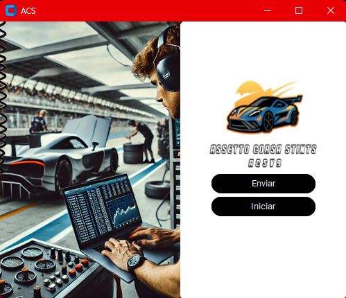
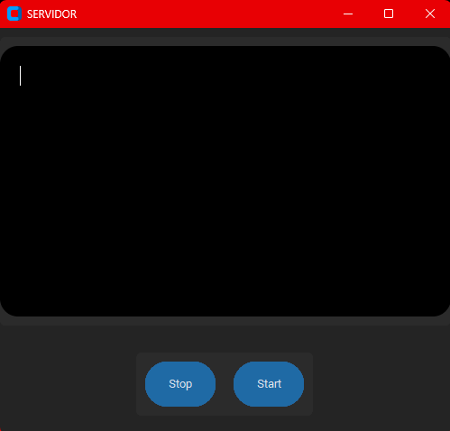
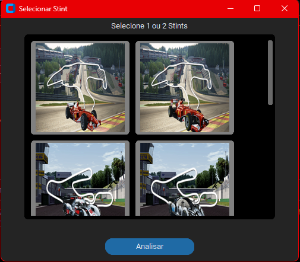
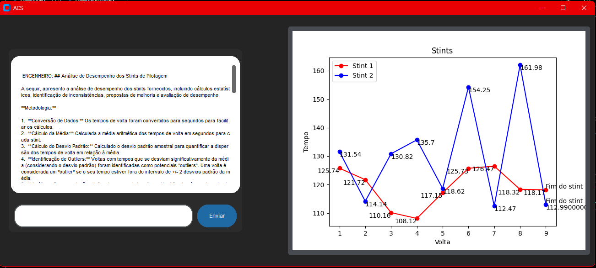
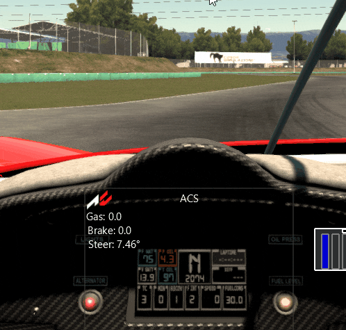

# 🏎️⚙️ Assetto Corsa Stints (ACS)

[](https://github.com/Otavio72/Assetto-Corsa-Stints-ACS-/blob/main/LICENSE)

**ACS** surgiu durante minha participação em um campeonato da **World Sim Series (WSS)**. Nos treinos, percebi a necessidade de uma análise mais detalhada dos stints (sequências de voltas), o que inspirou a criação deste projeto.

---

## 🛠️ Sobre o projeto

O **ACS** é uma aplicação local que extrai dados de telemetria do jogo Assetto Corsa, envia os tempos de volta para um servidor com banco de dados **MySQL**, e os recupera para gerar gráficos comparativos entre dois stints. Esses dados são enviados à API do **GEMINI**, onde um "engenheiro virtual" interpreta os resultados e fornece feedback técnico via chat.


### Funcionalidades principais:

- 🧾 Extração de dados via **Shared Memory**, com base no mod template de [Hunter Vaners](https://github.com/huntervaners/Template_Assetto_Corsa_App)
- 📈 Geração de gráficos comparativos com **Matplotlib**
- 🤖 Feedback técnico com **GEMINI API**
- 💾 Armazenamento em banco de dados **MySQL**
- 🌙 Interface gráfica com **CustomTkinter**
- 🔌 Comunicação entre cliente e servidor via Sockets com select para conexões simultâneas

---

## 💻 Layout da aplicação

### Página inicial


### Página de Status


### Menu de Stints


### Pagina de analise


---

## 🗂️ GIFs

## Datalogger


## Demonstração dentro do jogo
[Assista à demonstração no YouTube](https://www.youtube.com/watch?v=mdHSS1vnZvM)

---

## 🚀 Tecnologias utilizadas

### 🔙 Back end
- Python

### 💾 Banco de dados
- MySQL

### 🎨 Interface
- CustomTkinter

---

## ⚙️ Como executar o projeto

⚠️ Requisitos
- É necessário ter o jogo Assetto Corsa instalado para que o ACSv9 funcione corretamente, pois a extração de dados depende da Shared Memory do jogo.
- Sem o jogo instalado, o ACSv9 não irá funcionar.

🧪 **Versão de Demonstração (ACSvDEMO)**
Para contornar essa limitação, foi criada a versão ACSvDEMO, baseada em uma versão anterior do projeto que utiliza arquivos .csv simulando os dados extraídos do jogo.

- O ACSvDEMO está localizado dentro da pasta DEMO/.
- Ele permite a seleção e análise de stints simulados sem a necessidade do Assetto Corsa instalado.
- O menu de seleção de stints foi adaptado para funcionar de forma semelhante à versão completa.


### ✅ Pré-requisitos da versão demo

- Python 3.11+
- Ambiente virtual configurado

### 📦 Instalação

```bash
# clonar repositório
git clone https://github.com/Otavio72/Assetto-Corsa-Stints-ACS-.git

Ative o ambiente virtual:
  python -m venv .venv

No Windows (PowerShell):
  ```powershell
  .venv\Scripts\Activate.ps1

No Linux/macOS:
  source .venv/bin/activate

# acesse o diretorio
cd Assetto-Corsa-Stints-ACS-

Instale as dependências:
  pip install -r requirements.txt

# acesse o dirtetorio da versao demo
cd DEMO

# Rode
  python ACS.vDEMO.py

```

🧠 Melhorias Futuras

🌐 Interface web com Django, HTML, CSS, JavaScript e Bootstrap 5
Para tornar a análise acessível via navegador e facilitar o uso em diferentes plataformas.

🧱 Refatoração do código para POO (Programação Orientada a Objetos)
Visando melhor organização, reutilização e manutenção do código.

🧭 Reestruturação da arquitetura
Centralizar o processamento e análise de dados no servidor, deixando o cliente mais leve.

💾 Implementar uma tabela exclusiva para armazenar os dados enviados e recebidos da API de IA, permitindo melhor organização, rastreabilidade e expansão futura das funcionalidades do engenheiro virtual.
  
🎮 Extração de mais dados do jogo
Aprofundar a coleta de informações via Shared Memory para análises mais detalhadas (ex: temperatura dos pneus, consumo de combustível, etc.).

🤖 Substituição da API de IA
Buscar uma API mais rápida e com menos limitações para melhorar o desempenho e disponibilidade do feedback técnico.

🖥️ Melhorias na interface do Datalogger (dentro do jogo)
Refinar a visualização e usabilidade das informações exibidas durante as sessões.

🛡️ Tratamento de erros no socket
Fortalecer a robustez da comunicação entre cliente e servidor, com melhores mensagens de erro e reconexão automática.


# Autor
Otávio Ribeiro
[🔗LinkedIn](https://www.linkedin.com/in/otávio-ribeiro-57a359197)
